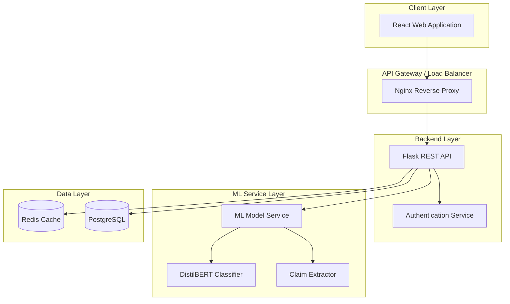

# Kiro Internal Files — DeceptiScan

This document catalogs all internal Kiro specification files for the DeceptiScan project. These files serve as the design blueprint, requirements specification, and task tracker that guide the project's implementation.

---

## Directory Structure

```
.kiro/
└── specs/
    └── deceptiscan/
        ├── .config.kiro          # Kiro spec metadata
        ├── requirements.md       # Functional & non-functional requirements
        ├── design.md             # Architecture, components, data models, API spec
        └── tasks.md              # Implementation task tracking with dependencies
```

---

## 1. `.config.kiro` — Spec Configuration

**Path:** `.kiro/specs/deceptiscan/.config.kiro`

Minimal metadata file identifying this as a **design-first** feature specification.

| Field | Value |
|---|---|
| `specId` | `e6870f4d-fb88-4748-a4f6-c1c068a73650` |
| `workflowType` | `design-first` |
| `specType` | `feature` |

---

## 2. `requirements.md` — Requirements Document

**Path:** `.kiro/specs/deceptiscan/requirements.md`  
**Lines:** 200

### Scope
DeceptiScan is a web-based misinformation detection tool using NLP (DistilBERT) to analyze news content. It provides sentence-level flagging of suspicious claims and an overall authenticity score (0–100).

### Glossary
- **Authenticity Score** — 0–100 numerical reliability rating
- **Classification** — `reliable`, `mixed`, `unreliable`, or `unknown`
- **Confidence Score** — 0–1 model certainty
- **DistilBERT** — Transformer model used for text classification
- **Content Hash** — SHA256 hash of input for caching

### Functional Requirements (13 total)

| # | Name | Key Acceptance Criteria |
|---|---|---|
| 1 | Article Text Analysis | Submit text → receive 0–100 score; red/green sentence highlighting |
| 2 | Input Validation | Content 1–50,000 chars; valid URL format; clear error messages |
| 3 | Analysis Response Format | Fields: id, authenticityScore, confidence, classification, sentenceAnalysis, processingTime, analyzedAt |
| 4 | Low Confidence Handling | `unknown` classification when confidence < 0.3; warning message |
| 5 | User Registration | Email + password → JWT token; duplicate email rejection |
| 6 | User Authentication | JWT login/logout; protected endpoints; token expiration |
| 7 | Analysis History | Paginated history; ownership enforcement; delete support |
| 8 | User Feedback | Types: helpful / incorrect / disputed; anonymous allowed |
| 9 | Rate Limiting | 10 req/min anonymous, 60 req/min authenticated; Redis-based |
| 10 | ML Service Availability | Error code `ANALYSIS_FAILED`; retry 3× with exponential backoff |
| 11 | Caching | SHA256-based cache; cache-hit indication in response |
| 12 | Analysis Deletion | Owner-only delete; unauthorized error for others |
| 13 | Health Check | Status, version, model readiness |

### Non-Functional Requirements
- **Performance:** <2s response (p95), 100+ concurrent users
- **Security:** bcrypt, input sanitization, CORS, XSS prevention
- **Reliability:** Graceful degradation, comprehensive logging
- **Privacy:** GDPR compliance, no sensitive content logging
- **Scalability:** Stateless horizontal scaling, connection pooling, Redis cluster

---

## 3. `design.md` — Design Document

**Path:** `.kiro/specs/deceptiscan/design.md`  
**Lines:** 952

### High-Level Architecture



### Data Flow
User → React → Flask → Cache check → (hit: return cached) or (miss: ML → DB → Cache) → Response with highlights + score

### Components

| Component | Tech | Responsibilities |
|---|---|---|
| React Frontend | React 18, TypeScript, Vite | ArticleInput, AnalysisResult, ScoreMeter, auth UI |
| Flask Backend | Flask 3.0, SQLAlchemy | REST API, validation, auth, caching, rate limiting |
| ML Service | DistilBERT, transformers, torch | Text preprocessing, sentence extraction, classification |
| Database | PostgreSQL 15 + Redis 7 | Persistent storage, caching, rate limiting |
| External (future) | Wikipedia API, rumor DB | Fact-checking, crowd-sourced verification |

### Data Models

**ArticleInput:** `content` (required, max 50K chars), `sourceUrl?`, `title?`, `language` (default: "en")

**AnalysisResult:** `id`, `authenticityScore` (0–100), `confidence` (0–1), `classification`, `sentenceAnalysis[]`, `processingTime`, `analyzedAt`, `modelVersion`

**SentenceAnalysis:** `index`, `text`, `isSuspicious`, `score` (0–100), `confidence`, `category` (factual/opinion/claim/context), `flags[]`, `explanation`

**UserFeedback:** `type` (helpful/incorrect/disputed), `correctedClassification?`, `comment?`

**ScoreMeter:** `value`, `label`, `color`, thresholds: reliable ≥75, mixed 40–74, unreliable <40

### API Endpoints

| Method | Path | Auth | Description |
|---|---|---|---|
| POST | `/api/v1/analyze` | Optional | Submit text for analysis |
| GET | `/api/v1/analyze/{id}` | Owner | Retrieve previous analysis |
| DELETE | `/api/v1/analyze/{id}` | Required | Delete analysis record |
| POST | `/api/v1/auth/register` | No | Register new user |
| POST | `/api/v1/auth/login` | No | User login |
| POST | `/api/v1/auth/logout` | Required | Invalidate session |
| GET | `/api/v1/auth/me` | Required | Current user profile |
| GET | `/api/v1/history` | Required | List analysis history (paginated) |
| GET | `/api/v1/history/{id}` | Owner | Specific analysis detail |
| POST | `/api/v1/feedback` | No | Submit feedback |
| GET | `/api/v1/health` | No | Service health check |

### Error Codes
`INVALID_INPUT`, `ANALYSIS_FAILED`, `RATE_LIMITED`, `NOT_FOUND`, `UNAUTHORIZED`, `INTERNAL_ERROR`

### Correctness Properties (10 total)
1. Score boundaries: 0 ≤ `authenticityScore` ≤ 100
2. Classification threshold consistency (≥75 reliable, 40–74 mixed, <40 unreliable)
3. Sentence coverage: all sentences appear in results with correct indices
4. Score meter color consistency (green reliable, red suspicious)
5. Low confidence → `unknown` classification + warning
6. Caching round-trip: repeat submissions return cached result
7. Response completeness: all required fields present
8. Input validation rejection for empty/oversized content
9. Feedback storage with valid analysisId
10. Rate limit enforcement for anonymous (10/min) and authenticated (60/min)

### Testing Strategy
- **Unit tests:** Backend (80% coverage), Frontend (70% coverage), ML Service (85% on utilities)
- **Property-based tests:** Hypothesis (Python), fast-check (TypeScript)
- **Integration tests:** Docker Compose with all services, mock ML model

### Performance Targets
- Analysis: <2s (p95)
- Frontend render: <100ms
- Initial load: <3s FCP
- Concurrent users: 100+

---

## 4. `tasks.md` — Task Tracking

**Path:** `.kiro/specs/deceptiscan/tasks.md`  
**Lines:** 289

### Dependency Graph
```
Task 1.1 ──┬──► Task 1.2
           ├──► Task 2.1 ──┬──► Task 2.2 ──► Task 2.3 ──► Task 2.8
           │               ├──► Task 2.4 ──► Task 2.5
           │               ├──► Task 2.6
           │               ├──► Task 2.7
           │               └──► Task 2.9
           ├──► Task 3.1 ──┬──► Task 3.2
           │               └──► Task 3.3
           └──► Task 4.1 ──┬──► Task 4.2
                           ├──► Task 4.3 ──► Task 4.4 ──► Task 4.6
                           ├──► Task 4.5
                           └──► (Task 5.1, 5.2, 5.3)
```

### Task Status Summary (27 total)

| Status | Count | Tasks |
|---|---|---|
| ✅ Completed | 17 | 1–11, 15–17 (infrastructure, DB, Flask core, validation, analysis, auth, history, feedback, rate limiting, caching, health, React setup, ArticleInput, ScoreMeter) |
| ❌ Not started | 10 | 12–14, 18–27 (ML service core, low confidence, ML retry, AnalysisResult UI, auth UI, history page, backend tests, property tests, frontend tests, integration tests, production config, deployment, recency-based verification routing) |

### Key Incomplete Tasks
- **Task 12** — ML Service Core: DistilBERT loading, preprocessing, sentence extraction, classification inference
- **Task 13** — Low Confidence Handling: threshold check, `unknown` classification, warning
- **Task 14** — ML Retry Logic: exponential backoff (max 3), `ANALYSIS_FAILED` error
- **Task 18** — AnalysisResult Display Component: sentence highlighting, explanations, disclaimer
- **Task 19** — Authentication UI: Login/Register pages, JWT storage, state management
- **Task 20** — History Page: paginated list, delete, detail view
- **Task 21–24** — Testing: backend unit tests, property-based tests (Hypothesis), frontend tests, integration tests
- **Task 25–26** — Production: Nginx, HTTPS, deployment scripts
- **Task 27** — Recency-Based Verification Routing: date detection, Google Fact Check Tools API, external verification fallback

---

## File Relationships

```
.config.kiro ─────────► metadata (specId, workflow type)
       │
       ▼
requirements.md ──────► what the system must do (13 FR + NFRs)
       │
       ▼
   design.md ─────────► how the system is built (architecture, models, API, properties)
       │
       ▼
   tasks.md ──────────► implementation plan (27 tasks, dependencies, status)
```

The `.config.kiro` file identifies the spec; `requirements.md` defines **what** to build; `design.md` defines **how** to build it; `tasks.md` tracks **what remains** to be implemented.
