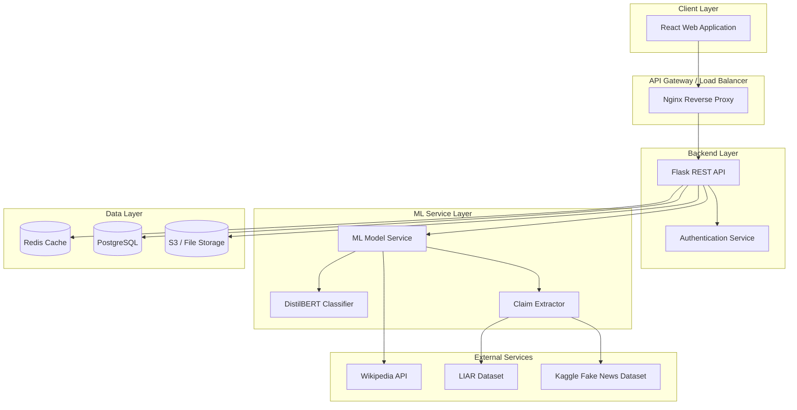
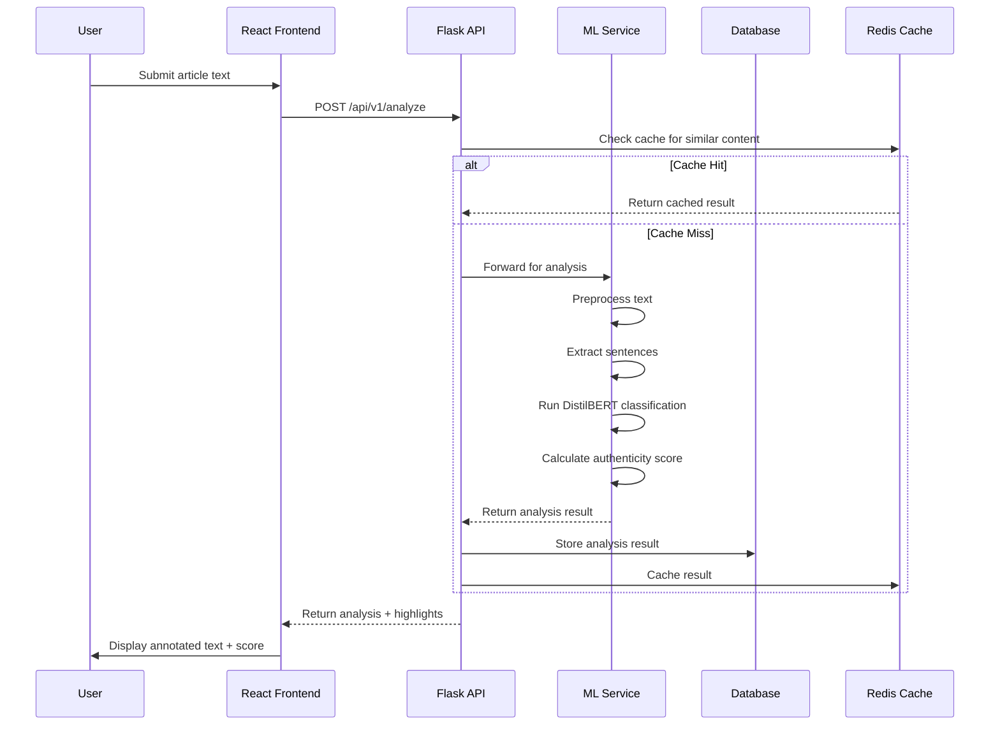
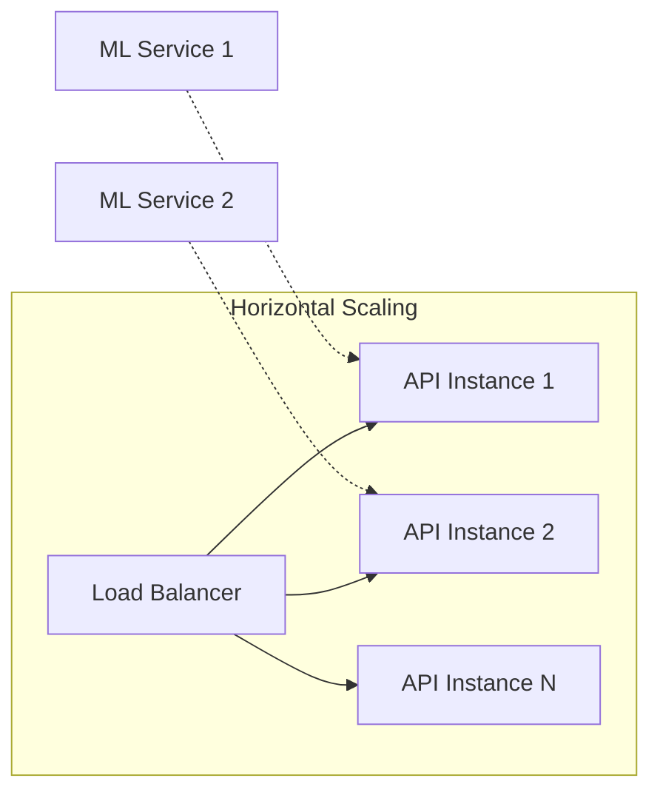

# Design Document: DeceptiScan

## Overview

DeceptiScan is a web-based misinformation detection tool that leverages NLP and machine learning to analyze news content and identify potentially false or misleading information. The system accepts news article text or URLs as input and provides sentence-level flagging of suspicious claims along with an overall authenticity score. The core technology uses transformer models (DistilBERT) fine-tuned on fake-news datasets to classify content and highlight suspicious sections with red/green annotations.

The platform targets English news content with a goal of achieving 85%+ accuracy on held-out test sets. The MVP focuses on text input with real-time analysis, while future iterations will support URL extraction, Wikipedia API fact-checking integration, and crowd-sourced rumor lists.

## Architecture

### High-Level System Architecture



### Data Flow Diagram



## Components and Interfaces

### Component 1: React Frontend

**Purpose**: User interface for submitting content and viewing analysis results with visual annotations

**Interface**:
```typescript
interface FrontendComponents {
  // Main application container
  App: {
    render(): React.ReactElement
  }

  // Input components
  ArticleInput: {
    props: {
      onSubmit: (text: string) => Promise<void>
      isLoading: boolean
    }
    methods: {
      handleTextChange(event: ChangeEvent): void
      handleSubmit(event: FormEvent): Promise<void>
    }
  }

  // Display components  
  AnalysisResult: {
    props: {
      result: AnalysisResult
      highlightedText: HighlightedSegment[]
    }
    methods: {
      renderScoreMeter(): JSX.Element
      renderHighlightedText(): JSX.Element
    }
  }

  ScoreMeter: {
    props: {
      score: number  // 0-100
      label: string  // "Reliable", "Suspicious", etc.
    }
  }

  // Types
  AnalysisResult: {
    id: string
    authenticityScore: number  // 0-100
    confidence: number  // 0-1
    classification: 'reliable' | 'mixed' | 'unreliable'
    sentences: SentenceAnalysis[]
    processedAt: Date
  }

  HighlightedSegment: {
    text: string
    startIndex: number
    endIndex: number
    classification: 'reliable' | 'suspicious' | 'neutral'
    confidence: number
    explanation: string
  }
}
```

**Responsibilities**:
- Capture user input (text paste or URL)
- Send analysis requests to backend API
- Render analysis results with color-coded highlighting
- Display authenticity score meter
- Handle loading states and error displays

### Component 2: Flask Backend API

**Purpose**: REST API handling business logic, request validation, and coordination between frontend and ML service

**Interface**:
```python
# Flask application structure
class FlaskApp:
    # Configuration
    config: {
        'SECRET_KEY': str,
        'SQLALCHEMY_DATABASE_URI': str,
        'REDIS_URL': str,
        'ML_SERVICE_URL': str,
        'MAX_CONTENT_LENGTH': int  # 50MB for article content
    }

    # Blueprint registrations
    blueprints: {
        'api_v1': Blueprint,  # /api/v1/*
        'auth': Blueprint,     # /auth/*
    }

# Request/Response models
class AnalyzeRequest:
    text: str              # Article content (required)
    url: str | None        # Source URL (optional)
    userId: str | None     # For authenticated requests

class AnalyzeResponse:
    id: str
    authenticityScore: float    # 0-100
    confidence: float           # 0-1
    classification: str         # "reliable" | "mixed" | "unreliable"
    sentences: list[SentenceResult]
    processingTime: float       # milliseconds

class SentenceResult:
    text: str
    index: int
    isSuspicious: bool
    confidence: float
    category: str              # "factual", "opinion", "claim", "context"
    explanation: str
```

**Responsibilities**:
- Accept and validate incoming requests
- Route requests to appropriate handlers
- Coordinate with ML service for analysis
- Manage caching via Redis
- Store results in PostgreSQL
- Handle authentication and rate limiting

### Component 3: ML Service (Transformer-Based Classification)

**Purpose**: Core NLP analysis engine using DistilBERT for content classification and claim extraction

**Interface**:
```python
class MLService:
    # Model configuration
    model_config: {
        'model_name': str,           # "distilbert-base-uncased"
        'fine_tuned_model_path': str, # Path to fine-tuned weights
        'max_sequence_length': int,   # 512 tokens
        'batch_size': int             # 16
    }

    # Core methods
    async def analyze(text: str) -> AnalysisResult:
        """Main entry point for text analysis"""
        pass

    async def preprocess(text: str) -> list[str]:
        """Clean and normalize input text"""
        pass

    async def extract_sentences(text: str) -> list[Sentence]:
        """Split text into analyzable sentences"""
        pass

    async def classify_sentence(sentence: str) -> ClassificationResult:
        """Classify individual sentence"""
        pass

    async def calculate_authenticity_score(
        sentence_results: list[ClassificationResult]
    ) -> float:
        """Calculate overall authenticity score"""
        pass

# Classification output
@dataclass
class ClassificationResult:
    text: str
    label: str              # "reliable" | "unreliable" | "neutral"
    confidence: float       # 0-1
    probabilities: dict     # {label: probability}
    features: list[str]     # Key features that influenced classification
    category: str           # Type of content
```

**Responsibilities**:
- Load and manage DistilBERT model
- Preprocess input text (cleaning, normalization)
- Split text into sentences for granular analysis
- Run classification inference
- Calculate composite authenticity score
- Generate explanations for classifications
- Cache model predictions when possible

### Component 4: Database Layer

**Purpose**: Persistent storage for analysis results, user data, and cached content

**Interface**:
```python
# Database models
class AnalysisRecord:
    id: str                    # UUID
    user_id: str | None        # FK to User (nullable for anon)
    input_text: str            # Original text (or hash for large)
    source_url: str | None
    authenticity_score: float
    confidence: float
    classification: str
    raw_sentence_results: JSON  # Serialized sentence analysis
    created_at: datetime
    
class User:
    id: str
    email: str
    password_hash: str
    created_at: datetime
    is_active: bool

class UserFeedback:
    id: str
    analysis_id: str           # FK to AnalysisRecord
    user_id: str | None        # FK to User
    feedback_type: str         # "correct", "incorrect", "disputed"
    comment: str | None
    created_at: datetime

class CachedAnalysis:
    content_hash: str          # SHA256 of input text
    result: JSON               # Cached AnalysisResult
    expires_at: datetime
    created_at: datetime

# Redis cache keys
CACHE_KEYS = {
    'analysis': 'analysis:{hash}',
    'user_session': 'session:{user_id}',
    'rate_limit': 'ratelimit:{ip}:{endpoint}',
    'model_warmup': 'model:warmup:status'
}
```

**Responsibilities**:
- Store analysis history for users
- Cache frequently requested analyses
- Maintain user accounts and preferences
- Store user feedback for model improvement
- Manage session tokens

### Component 5: External Integrations (Future)

**Purpose**: Interfaces for future feature expansion

**Interface**:
```python
class WikipediaIntegration:
    """Future: Wikipedia API fact-checking"""
    async def search_claim(claim: str) -> list[WikipediaResult]:
        """Search Wikipedia for claim verification"""
        pass
    
    async def get_related_facts(entity: str) -> list[Fact]:
        """Get related facts for an entity"""
        pass

class RumorDatabase:
    """Future: Crowd-sourced rumor list"""
    async def check_rumor(text: str) -> RumorStatus:
        """Check against known rumor database"""
        pass
    
    async def submit_rumor(claim: str, status: str) -> None:
        """Submit new rumor for community review"""
        pass
```

## Data Models

### Model 1: Article Input

```typescript
interface ArticleInput {
  // Primary input
  content: string           // Required: Article text (max 50,000 chars)
  sourceUrl?: string        // Optional: Source URL if available
  title?: string           // Optional: Article title
  
  // Metadata
  language: string         // Default: "en"
  contentType: 'text' | 'url'  // Input type
}
```

**Validation Rules**:
- `content` must be non-empty string
- `content` maximum 50,000 characters
- `sourceUrl` must be valid URL format if provided
- `language` must be "en" for MVP (English only)

### Model 2: Analysis Result

```typescript
interface AnalysisResult {
  // Identifiers
  id: string               // UUID
  analysisVersion: string  // e.g., "1.0.0"
  
  // Scores
  authenticityScore: number       // 0-100 (higher = more reliable)
  confidenceScore: number         // 0-1 (model confidence)
  classification: Classification  // Primary classification
  
  // Detailed analysis
  sentenceAnalysis: SentenceAnalysis[]
  overallSummary: string          // Brief explanation
  
  // Metadata
  processingTime: number          // milliseconds
  analyzedAt: string              // ISO 8601 timestamp
  modelVersion: string            // ML model version
}

type Classification = 'reliable' | 'mixed' | 'unreliable' | 'unknown'

interface SentenceAnalysis {
  index: number           // Position in original text
  text: string           // The sentence
  isSuspicious: boolean  // Flagged as potentially misleading
  score: number          // Individual sentence score (0-100)
  confidence: number     // 0-1
  category: string       // "factual" | "opinion" | "claim" | "context"
  flags: string[]        // Specific flags raised
  explanation: string    // Human-readable explanation
}
```

### Model 3: User Feedback

```typescript
interface UserFeedback {
  id: string
  analysisId: string     // Reference to analysis result
  userId: string | null  // Anonymous if null
  
  feedback: {
    type: 'helpful' | 'incorrect' | 'disputed'
    correctedClassification?: Classification
    comment?: string
  }
  
  createdAt: string
}
```

### Model 4: Score Meter Display

```typescript
interface ScoreMeter {
  value: number           // 0-100
  label: string           // "Highly Reliable" | "Mostly Reliable" | "Mixed" | "Suspicious" | "Unreliable"
  color: string           // Hex color code
  interpretation: string  // User-friendly explanation
  
  // Thresholds
  thresholds: {
    reliable: number      // >= 75
    mixed: number         // 40-74
    unreliable: number    // < 40
  }
}
```

## API Endpoints Design

### Core Analysis Endpoints

```yaml
POST /api/v1/analyze
  Description: Analyze text for misinformation
  Request Body:
    content: string (required, max 50000 chars)
    sourceUrl: string (optional)
    title: string (optional)
  Response: AnalysisResult
  Rate Limit: 10 requests/minute (anonymous), 60/minute (authenticated)
  Caching: GET /api/v1/analyze/{content_hash}

GET /api/v1/analyze/{id}
  Description: Retrieve previous analysis by ID
  Response: AnalysisResult
  Auth Required: If analysis was saved to user account

DELETE /api/v1/analyze/{id}
  Description: Delete analysis record
  Auth Required: Yes (owner only)
```

### User Management Endpoints

```yaml
POST /api/v1/auth/register
  Description: Register new user account
  Request: { email, password, confirmPassword }
  Response: { userId, token }

POST /api/v1/auth/login
  Description: User login
  Request: { email, password }
  Response: { token, user }

POST /api/v1/auth/logout
  Description: Invalidate session
  Auth Required: Yes

GET /api/v1/auth/me
  Description: Get current user profile
  Auth Required: Yes
```

### Analysis History Endpoints

```yaml
GET /api/v1/history
  Description: List user's analysis history
  Query Params: page, limit, sort
  Auth Required: Yes

GET /api/v1/history/{id}
  Description: Get specific analysis
  Auth Required: Yes (owner only)
```

### Feedback Endpoints

```yaml
POST /api/v1/feedback
  Description: Submit feedback on analysis
  Request: { analysisId, feedback }
  Auth Required: No (anonymous allowed)
  Response: { feedbackId }
```

### Health and Status Endpoints

```yaml
GET /api/v1/health
  Description: Service health check
  Response: { status, version, modelStatus }

GET /api/v1/models/status
  Description: ML model status
  Response: { loaded, version, averageInferenceTime }
```

### Error Responses

```yaml
Error Response Format:
  error: {
    code: string      # Error code
    message: string   # Human-readable message
    details: object   # Additional context
  }

Common Error Codes:
  - INVALID_INPUT: Invalid request parameters
  - ANALYSIS_FAILED: ML processing failed
  - RATE_LIMITED: Too many requests
  - NOT_FOUND: Resource not found
  - UNAUTHORIZED: Authentication required
  - INTERNAL_ERROR: Server error
```

## Error Handling

### Error Scenario 1: Invalid Input

**Condition**: User submits empty text or text exceeding maximum length
**Response**:
```json
{
  "error": {
    "code": "INVALID_INPUT",
    "message": "Article content must be between 1 and 50,000 characters",
    "details": {
      "field": "content",
      "minLength": 1,
      "maxLength": 50000
    }
  }
}
```
**Recovery**: User corrects input and resubmits

### Error Scenario 2: ML Service Unavailable

**Condition**: ML model fails to load or crashes during analysis
**Response**:
```json
{
  "error": {
    "code": "ANALYSIS_FAILED",
    "message": "Analysis service temporarily unavailable",
    "details": {
      "retryAfter": 30
    }
  }
}
```
**Recovery**: Automatic retry with exponential backoff (max 3 attempts); user notified to retry later

### Error Scenario 3: Rate Limiting

**Condition**: User exceeds API rate limit
**Response**:
```json
{
  "error": {
    "code": "RATE_LIMITED",
    "message": "Too many requests. Please wait before trying again.",
    "details": {
      "limit": "10 per minute",
      "retryAfter": 45
    }
  }
}
```
**Recovery**: Wait for rate limit window to reset; suggest authentication for higher limits

### Error Scenario 4: Low Confidence Result

**Condition**: ML model returns confidence below threshold (0.3)
**Response**: Return analysis result with `classification: "unknown"` and warning
```json
{
  "authenticityScore": 50,
  "confidence": 0.25,
  "classification": "unknown",
  "warning": "Low confidence in analysis result"
}
```
**Recovery**: Display disclaimer to user; offer to submit for human review

## Testing Strategy

### Unit Testing Approach

**Key Test Cases for Backend**:
- Input validation (text length, URL format)
- API response format compliance
- Authentication flow (register, login, logout)
- Rate limiting enforcement
- Cache behavior

**Key Test Cases for Frontend**:
- Component rendering with different result states
- Score meter display accuracy
- Highlight rendering correctness
- Error state displays
- Loading state transitions

**Key Test Cases for ML Service**:
- Sentence extraction accuracy
- Classification output format
- Score calculation correctness
- Model inference performance

**Coverage Goals**:
- Backend: 80%+ code coverage
- Frontend: 70%+ component coverage
- ML Service: 85%+ coverage on utility functions

### Property-Based Testing Approach

**Property Test Library**: Hypothesis (Python), fast-check (TypeScript)

**Properties to Test**:
1. Score boundaries: `0 <= authenticityScore <= 100` for all valid inputs
2. Confidence bounds: `0 <= confidence <= 1` always
3. Sentence coverage: All input sentences appear in results
4. Index consistency: Sentence indices match original text positions
5. Determinism: Same input produces same output (non-random model)

### Integration Testing Approach

**Test Scenarios**:
1. End-to-end analysis flow: Submit text → Receive result → Display correctly
2. Authentication flow: Register → Login → Access protected resources
3. Caching flow: First request → Cache hit → Return cached result
4. Error propagation: ML failure → API error → User-friendly message

**Test Environment**:
- Docker Compose setup with all services
- Mock ML model for fast testing
- Test database with seed data

## Performance Considerations

### Backend Performance

- **Target Response Time**: < 2 seconds for analysis (p95)
- **Concurrent Requests**: Support 100+ concurrent users
- **Caching Strategy**: Cache analysis results with content hash
- **Connection Pooling**: PostgreSQL and Redis connection pooling

### ML Service Performance

- **Model Loading**: Lazy load on first request, keep warm
- **Inference Time Target**: < 500ms per article (p95)
- **Batch Processing**: Process multiple sentences in batch when possible
- **GPU Utilization**: Use GPU when available, fallback to CPU

### Frontend Performance

- **Initial Load**: < 3 seconds first contentful paint
- **Result Rendering**: < 100ms for highlight rendering
- **Bundle Size**: < 200KB gzipped

### Scalability Architecture



- API layer: Horizontally scalable (stateless Flask instances)
- ML layer: Scale based on demand, consider GPU pooling
- Database: Connection pooling, read replicas for queries
- Cache: Redis cluster for high availability

## Security Considerations

### Input Validation

- Sanitize all user input to prevent injection attacks
- Validate content length to prevent DoS
- URL validation before fetching external content
- Escape HTML in displayed results to prevent XSS

### Authentication & Authorization

- Password hashing (bcrypt with salt)
- JWT tokens with expiration
- Rate limiting per user/IP
- CSRF protection for state-changing operations

### API Security

- HTTPS only in production
- CORS configuration for allowed origins
- Request size limits
- API key for internal services

### Data Privacy

- No logging of sensitive content
- Anonymize analytics data
- GDPR compliance: Data export/deletion on request
- Clear privacy policy for user data

### ML Model Security

- Input sanitization before model inference
- Output validation before response
- No storage of submitted content (only analysis results)
- Model versioning for rollback capability

## Dependencies

### Backend Dependencies

```python
# requirements.txt - Core
flask==3.0.0
flask-cors==4.0.0
flask-sqlalchemy==3.1.1
psycopg2-binary==2.9.9
redis==5.0.1
python-jose[cryptography]==3.3.0
bcrypt==4.1.1
pydantic==2.5.0

# ML dependencies
transformers==4.35.0
torch==2.1.0
sentencepiece==0.1.99
numpy==1.26.0

# Utilities
python-dotenv==1.0.0
requests==2.31.0
```

### Frontend Dependencies

```json
// package.json
{
  "dependencies": {
    "react": "^18.2.0",
    "react-dom": "^18.2.0",
    "axios": "^1.6.0",
    "react-router-dom": "^6.20.0",
    "typescript": "^5.3.0"
  },
  "devDependencies": {
    "@types/react": "^18.2.0",
    "vite": "^5.0.0",
    "eslint": "^8.55.0"
  }
}
```

### Infrastructure

- **Web Server**: Nginx (reverse proxy)
- **Database**: PostgreSQL 15+
- **Cache**: Redis 7+
- **Containerization**: Docker, Docker Compose
- **ML Runtime**: CUDA 12+ (optional, GPU support)

## Future Integration Points

### Wikipedia API Fact-Checking

```python
# Planned integration
class WikipediaFactChecker:
    async def verify_claim(claim: str) -> FactCheckResult:
        """
        1. Extract key entities from claim
        2. Search Wikipedia for related articles
        3. Compare claim against Wikipedia facts
        4. Return verification result
        """
```

**Integration Point**: Add as post-processing step after ML classification

### Crowd-Sourced Rumor Database

```python
# Planned integration
class RumorDatabase:
    async def check_against_rumors(text: str) -> RumorCheckResult:
        """
        1. Hash significant phrases
        2. Query rumor database
        3. Return matching rumors with status
        """
```

**Integration Point**: Add as pre-processing check before ML analysis

### URL Content Extraction

```python
# Planned integration
class URLProcessor:
    async def extract_content(url: str) -> ExtractedContent:
        """
        1. Fetch URL with proper headers
        2. Parse HTML/extract article content
        3. Clean and normalize text
        4. Return article text
        """
```

**Integration Point**: Add as input preprocessing in Flask API

### Report Generation

**Planned Features**:
- PDF export of analysis reports
- Shareable analysis links
- Batch analysis for content moderation teams

## Appendix: Classification Categories

| Category | Description | Example |
|----------|-------------|---------|
| factual | Contains verifiable facts | "The capital of France is Paris" |
| opinion | Subjective statement | "This is the best movie I've seen" |
| claim | Unverified assertion | "Studies show coffee causes cancer" |
| context | Background information | "Since 2020, the economy has grown" |

## Appendix: Flag Types

| Flag | Description |
|------|-------------|
| sensationalism | Sensationalist language detected |
| logical_fallacy | Common logical fallacy detected |
| unverified_claim | Claim without supporting evidence |
| loaded_language | Biased or emotional language |
| oversimplification | Complex issue oversimplified |
| contradiction | Contradicts known facts |

## Correctness Properties

*A property is a characteristic or behavior that should hold true across all valid executions of a system-essentially, a formal statement about what the system should do. Properties serve as the bridge between human-readable specifications and machine-verifiable correctness guarantees.*

### Property 1: Authenticity Score Boundaries

*For any* valid input text submitted for analysis, the System SHALL return an authenticityScore between 0 and 100 inclusive

**Validates: Requirements 1.2, 3.4, 3.5, 3.6**

### Property 2: Classification Threshold Consistency

*For any* analysis result, the classification SHALL be consistent with the authenticityScore thresholds: reliable when score >= 75, mixed when 40 <= score <= 74, unreliable when score < 40

**Validates: Requirements 3.4, 3.5, 3.6**

### Property 3: Sentence Coverage

*For any* text submitted for analysis, all sentences in the original text SHALL appear in the sentenceAnalysis array with correct indices

**Validates: Requirements 1.4**

### Property 4: Score Meter Color Consistency

*For any* analysis result, the frontend SHALL display green highlighting for reliable sentences and red highlighting for suspicious sentences based on their individual classifications

**Validates: Requirements 1.4**

### Property 5: Low Confidence Unknown Classification

*For any* analysis where the ML model's confidence is below 0.3, the System SHALL return classification as "unknown" and include a warning message

**Validates: Requirements 4.1, 4.2**

### Property 6: Caching Round Trip

*For any* content that is submitted twice for analysis, the second request SHALL return the cached result when available

**Validates: Requirements 11.1**

### Property 7: Analysis Response Completeness

*For any* successful analysis, the response SHALL include id, authenticityScore, confidence, classification, sentenceAnalysis, processingTime, and analyzedAt timestamp

**Validates: Requirements 3.1, 3.2, 3.3**

### Property 8: Input Validation Rejection

*For any* input where content is empty or exceeds 50,000 characters, the System SHALL return an INVALID_INPUT error with appropriate message

**Validates: Requirements 2.1, 2.2**

### Property 9: Feedback Storage

*For any* submitted feedback with valid analysisId and feedback type, the System SHALL store the feedback and return a feedbackId

**Validates: Requirements 8.1, 8.2, 8.3**

### Property 10: Rate Limit Enforcement

*For any* anonymous user making more than 10 requests per minute, the System SHALL return a RATE_LIMITED error; for authenticated users exceeding 60 requests per minute, the System SHALL return a RATE_LIMITED error

**Validates: Requirements 9.1, 9.2**